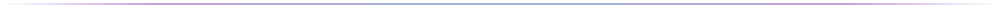

<!-- ===================== HEADER ===================== -->

<!-- Typing animation -->

 

<!-- Badges -->

<!-- ===================== ABOUT ===================== -->

## 💻 About Me

- 🔭 Currently working as a **C++ Development Engineer**
- 🌱 Currently learning **Modern C++**
- 🎆 Interested in **strange things**
- 💬 Ask me about anything — I'm happy to help
- 📫 How to reach me: **reall_ss@163.com**

<!-- ===================== TECH STACK ===================== -->

## 🛠️ Tech Stack

<!-- ===================== GITHUB STATS ===================== -->

## 📊 GitHub Stats

<!-- These cards are self-hosted: generated daily by .github/workflows/stats.yml -->

<!-- ===================== CONTRIBUTION SNAKE ===================== -->

## 🐍 Contribution Snake

<!-- Light / dark adaptive: both SVGs are generated by .github/workflows/snake.yml -->

<picture>
  <source media="(prefers-color-scheme: dark)" srcset="https://raw.githubusercontent.com/showmakerxoxo/showmakerxoxo/output/github-contribution-grid-snake-dark.svg" />
  <source media="(prefers-color-scheme: light)" srcset="https://raw.githubusercontent.com/showmakerxoxo/showmakerxoxo/output/github-contribution-grid-snake.svg" />
  
</picture>

<!-- ===================== FOOTER ===================== -->

 

---

Thanks for visiting! Give it a ⭐ if you like it · © 2026 showmakerxoxo · [MIT](LICENSE)

